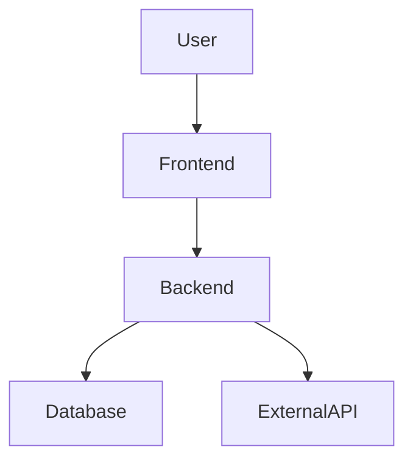
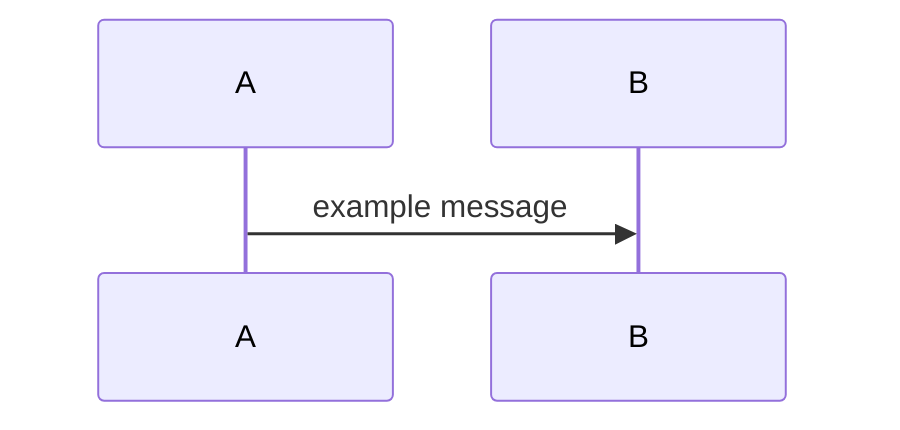

# Solution Analysis

## 1. Overview

* **Project Name**: Example Project
* **Version**: 1.0.0
* **Date**: YYYY-MM-DD
* **Author(s)**: Your Name
* **Status**: Draft

### 1.1 Purpose

This document provides a detailed analysis of the proposed solution, including component-level design, trade-offs, risks, and rationale for architectural decisions.

### 1.2 Scope

* Component-level analysis
* Trade-offs, risks, and constraints
* Alternative solutions evaluation

### 1.3 Definitions

| Term | Description             |
| ---- | ----------------------- |
| TCO  | Total Cost of Ownership |
| SLA  | Service Level Agreement |

---

## 2. Functional Analysis

| Component       | Function           | Description            | Dependencies        |
| --------------- | ------------------ | ---------------------- | ------------------- |
| Example Service | Example capability | One-line behavior      | Other modules       |

---

## 3. Detail Architecture

### 3.1 System Context

### 3.2 Changes Overview

* Architecture Style: Microservices
* Communication: REST APIs
* Key Decisions:

  * Stateless services
  * Separation of concerns
  * API-first design

### 3.3 Methods and symbols to change

> **Required for `game-boom-minimal` OpenSpec changes:** per-file tables for implementers. Use **Change** / **Add** / **Remove** / **No change** with concrete behavior. Scan real `src/` when editing existing code.

### `path/to/file.ts`

| Symbol   | Change |
| -------- | ------ |
| `fnName` | **Change** — what to do |

---

## 4. Design Alternatives

| Component   | Option   | Pros  | Cons  | Recommendation |
| ----------- | -------- | ----- | ----- | -------------- |
| Example     | Option A |       |       |                |

---

## 5. Detailed Component Analysis

### Component: Example

* **Responsibilities**:
* **Interfaces**:
* **Dependencies**:
* **Performance Considerations**:
* **Security Analysis**:

---

## 6. Data Flow Analysis

---

## 7. Risk & Impact Analysis

| Risk   | Probability | Impact | Mitigation |
| ------ | ----------- | ------ | ---------- |
| Example | Low        | Medium |            |

---

## 8. Testing Strategy

| Test Case ID | Component       | Type        | Input                      | Expected Output              | Description                               |
| ------------ | --------------- | ----------- | -------------------------- | ---------------------------- | ----------------------------------------- |
| TC-001       | User Service    | Unit Test   | Valid login credentials    | Success response, token      | Verify correct login flow                 |
| TC-002       | User Service    | Unit Test   | Invalid password           | Error response               | Ensure invalid login is rejected          |
| TC-003       | Payment Service | Unit Test   | Valid payment request      | Payment confirmed            | Test internal payment logic               |
| TC-004       | Payment Service | Integration | Payment request + DB order | Payment and order saved      | Verify DB and payment gateway interaction |
| TC-005       | Backend API     | Integration | Complete order submission  | Order confirmed, email sent  | Test end-to-end order processing flow     |
| TC-006       | Database        | Unit Test   | Insert record              | Record successfully inserted | Test data integrity and constraints       |
| TC-007       | Backend API     | Integration | Invalid request            | Error response, no DB change | Ensure proper error handling and rollback |

---

## 9. Open Questions

* 
---

## 10. Appendix

### 10.1 References

* Product requirements document
* API specifications

### 10.2 Change Log

| Version | Date       | Changes         |
| ------- | ---------- | --------------- |
| 1.0.0   | 2026-04-05 | Initial version |
