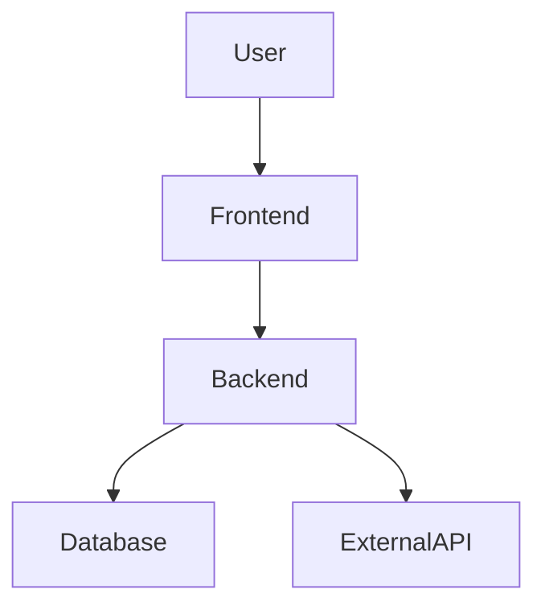
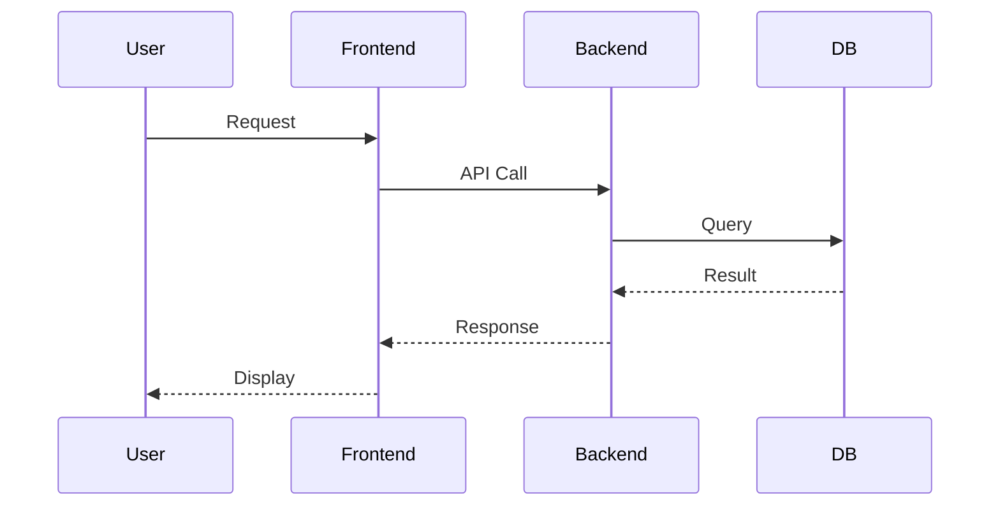

# Solution Architecture

## 1. Overview

* **Project Name**: Example Project
* **Version**: 1.0.0
* **Date**: 2026-04-05
* **Author(s)**: Your Name
* **Status**: Draft

### 1.1 Purpose

This document describes the solution architecture for the Example Project. It outlines system structure, components, integrations, and key design decisions.

### 1.2 Scope

**Included:**

* Core system architecture
* Components and interactions
* Deployment design

**Excluded:**

* Detailed UI design
* Implementation-level code

### 1.3 Definitions

| Term | Description                       |
| ---- | --------------------------------- |
| API  | Application Programming Interface |
| DB   | Database                          |
| NFR  | Non-functional Requirement        |

---

## 2. Requirements Mapping

### 2.1 Functional Requirements

| ID     | Description                   | Source       |
| ------ | ----------------------------- | ------------ |
| FR-001 | User can register account     | Product Spec |
| FR-002 | User can log in               | Product Spec |
| FR-003 | System processes transactions | Business Req |

### 2.2 Non-Functional Requirements

| ID      | Type         | Description               |
| ------- | ------------ | ------------------------- |
| NFR-001 | Performance  | Response time < 200ms     |
| NFR-002 | Availability | 99.9% uptime              |
| NFR-003 | Security     | Data encrypted in transit |

---

## 3. High-Level Architecture

### 3.1 System Context

### 3.2 Architecture Overview

* Architecture Style: Microservices
* Communication: REST APIs
* Key Decisions:

  * Stateless services
  * Separation of concerns
  * API-first design

### 3.3 Components

| Component    | Responsibility          |
| ------------ | ----------------------- |
| Frontend     | User interface          |
| Backend API  | Business logic          |
| Database     | Data storage            |
| External API | Third-party integration |

### 3.4 High-level changes (before → after)

> **Required for `game-boom-minimal` OpenSpec changes** when altering existing behavior: table of **Area | Today (before) | After this change**, plus optional **unchanged boundary** bullet list.

| Area | Today (before) | After this change |
| ---- | -------------- | ----------------- |
| Example area | Current behavior | New behavior |

**Unchanged boundary (optional):** what explicitly stays the same.

---

## 4. Detailed Design

### 4.1 Component Breakdown

#### Component: Frontend

* **Description**: Web UI for users
* **Responsibilities**:

  * Render UI
  * Handle user interactions
* **Dependencies**:

  * Backend API
* **Interfaces**:

  * REST endpoints

#### Component: Backend API

* **Description**: Core application logic
* **Responsibilities**:

  * Process requests
  * Validate data
* **Dependencies**:

  * Database
  * External APIs
* **Interfaces**:

  * REST API

#### Component: Database

* **Description**: Persistent storage
* **Responsibilities**:

  * Store application data
* **Dependencies**:

  * None
* **Interfaces**:

  * SQL queries

---

### 4.2 Data Flow

---

### 4.3 Data Model

| Entity | Fields                      |
| ------ | --------------------------- |
| User   | id, name, email, password   |
| Order  | id, user_id, amount, status |

---

## 5. Technology Stack

| Layer          | Technology | Justification          |
| -------------- | ---------- | ---------------------- |
| Frontend       | React      | Component-based UI     |
| Backend        | Node.js    | Scalable, async        |
| Database       | PostgreSQL | Reliable relational DB |
| Infrastructure | Docker     | Containerization       |

---

## 6. Observability

### 6.1 Logging

* Centralized logging system

### 6.2 Monitoring

* Metrics collection (CPU, memory, latency)

### 6.3 Alerting

* Alerts on threshold breaches

---

## 7. Risks & Trade-offs

| Risk                 | Impact             | Mitigation       |
| -------------------- | ------------------ | ---------------- |
| High traffic spikes  | System slowdown    | Auto-scaling     |
| External API failure | Service disruption | Retry + fallback |

---

## 8. Open Questions

* What is the expected peak load?
* Are there regulatory requirements?

---

## 9. Appendix

### 9.1 References

* Product requirements document
* API specifications

### 9.2 Change Log

| Version | Date       | Changes         |
| ------- | ---------- | --------------- |
| 1.0.0   | 2026-04-05 | Initial version |
