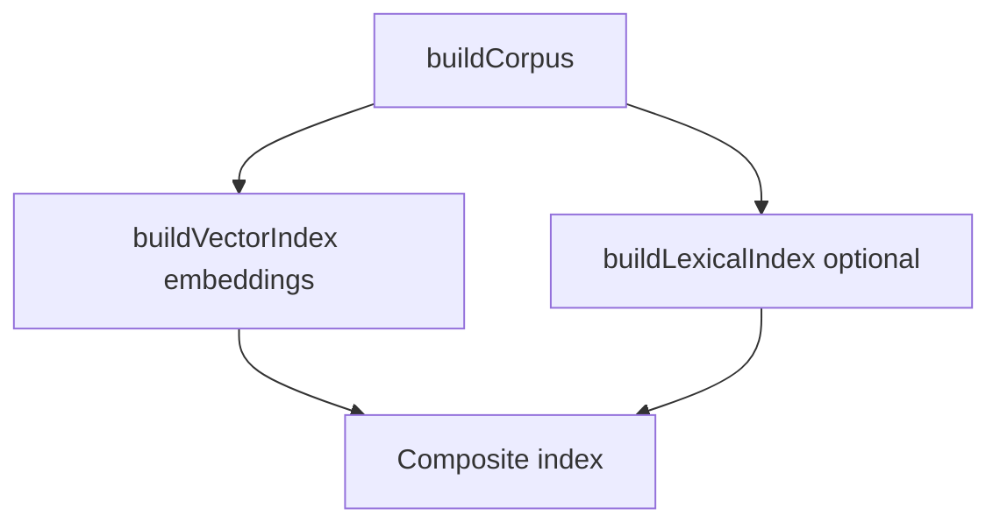

# Solution Analysis

## 1. Overview

* **Change**: enhanced-complex-query-answering
* **Project**: local-doc-ai
* **Date**: 2026-04-19
* **Status**: Draft

### 1.1 Purpose

This document provides **implementation-facing detail** for the enhancement: which modules and symbols change, proposed configuration keys, retrieval data shapes, MCP input/output conventions, dependencies, and a test matrix. It assumes the repository already contains the baseline MCP implementation (`src/`, `buildVectorIndex`, `registerLocalDocTools`, etc.).

### 1.2 Scope

* File-level plan for TypeScript modules under `src/`
* Configuration schema additions (`loadConfig` / packaged YAML)
* Risks and alternatives at implementation depth
* Excludes line-by-line coding until `/opsx:apply` execution

### 1.3 Definitions

| Term | Description |
| ---- | ----------- |
| Chunk ID | Stable identifier tying dense vector, lexical posting lists, and MCP hit lines |
| Fusion weights | Configured scalars for combining dense and lexical contributions |

---

## 2. Functional analysis

| Area | Function | Description | Dependencies |
| ---- | -------- | ----------- | ------------ |
| Config | Extend schema | New `retrieval.*` keys for strategy, hybrid, pool, MMR, verbosity defaults | `zod`, YAML |
| Ingestion | Feed lexical builder | Corpus chunks already carry `text`; lexical build consumes same list at index-build time | `buildCorpus` output |
| Lexical index | Build / query | Tokenize, accumulate DF/TF or BM25 stats; query returns scores per chunk | Optional `natural`, `wink-bm25`, or minimal in-house BM25 |
| Search | Fuse + diversify | Combine dense + lexical, apply MMR, trim to `top_k` | `VectorIndex`, lexical index |
| MCP | Tools | Extend `search_docs`; add `search_docs_multi` (name TBD in implementation); optional metadata block | SDK + Zod |
| Entry | Wire-up | Pass hybrid index or composite object into tool registration | `index.ts` |

---

## 3. Detail architecture

### 3.1 Process diagram (build)



### 3.2 Proposed configuration keys (illustrative)

Exact names MUST match the Zod schema in `loadConfig.ts` at implementation time; below is a working sketch:

| Key | Type | Purpose |
| --- | ---- | ------- |
| `retrieval.method` | `semantic` \| `hybrid` | Selects lexical+dense vs dense-only |
| `retrieval.hybrid.dense_weight` | number | Fusion weight for dense contribution |
| `retrieval.hybrid.lexical_weight` | number | Fusion weight for lexical contribution |
| `retrieval.candidate_pool` | number | Retrieve at least this many before MMR (≥ `top_k`) |
| `retrieval.mmr.enabled` | boolean | Turn diversity step on/off |
| `retrieval.mmr.lambda` | number | MMR balance parameter if enabled |
| `retrieval.verbose_hits_default` | boolean | Default for including metadata in tools |
| `tools_multi_query.enabled` | boolean | Register multi-query tool |

Defaults MUST preserve **semantic-only** behavior when unset or when `method` is `semantic`.

### 3.3 Data shapes

**Composite index handle (conceptual)**

```ts
// Conceptual — actual types live next to VectorIndex
interface SearchHit {
  id: string;
  relativePath: string;
  chunkIndex: number;
  text: string;
  score: number;
  denseScore?: number;
  lexicalScore?: number;
  fusionScore?: number;
}
```

**`search_docs` input (additive)**

* `query`: `string` (required)
* `include_metadata?`: `boolean`
* `path_prefix?`: `string` (must resolve under allowed roots)

**Multi-query tool input (additive)**

* `queries`: `string[]` (min 1, max N per implementation)
* Optional same filters as `search_docs`

**Tool output**

* Default: existing plain-text hit list
* With metadata: append or embed a JSON object listing scores and method (exact format fixed in code + tests)

---

## 4. Methods and symbols to change

### `src/config/loadConfig.ts`

| Symbol | Change |
| ------ | ------ |
| `RawConfigSchema` / `retrieval` | **Extend** — new fields for hybrid, fusion, pool, MMR, verbosity |
| `AppConfig` | **Extend** — inferred types include new keys |

### `src/ingestion/buildCorpus.ts`

| Symbol | Change |
| ------ | ------ |
| `buildCorpus` | **Optional** — export or return data needed for lexical build without breaking callers (may remain unchanged if lexical build runs in `index.ts` from corpus array) |

### `src/search/vectorIndex.ts`

| Symbol | Change |
| ------ | ------ |
| `VectorIndex` | **Extend** or **compose** — add methods returning dense scores for query embedding; OR wrap in `HybridRetriever` class |
| New `lexicalIndex.ts` (or similar) | **Add** — build from chunk texts; `score(query: string): Map<id, number>` |

### `src/mcp/registerTools.ts`

| Symbol | Change |
| ------ | ------ |
| `registerLocalDocTools` | **Extend** — accept composite index / retriever; extend `search_docs` schema; register multi-query tool |
| Tool handlers | **Add** — merge path for multiple queries; metadata formatting |

### `src/index.ts`

| Symbol | Change |
| ------ | ------ |
| `main` | **Extend** — build lexical index when configured; construct retriever; pass into `registerLocalDocTools` |

### `package.json`

| Symbol | Change |
| ------ | ------ |
| `dependencies` | **May add** — tokenizer/BM25 library if not implementing in-house |

---

## 5. Algorithms (reference)

1. **Fusion**: `fusionScore = wd * denseNorm + wl * lexicalNorm` with normalization strategy documented in code (min-max per query or fixed scale).
2. **MMR**: Standard formulation over candidate pool; parameter `lambda` from config.
3. **Multi-query merge**: Embed each query; take union of top candidates per query or sum fusion scores with dedupe by chunk `id`; then re-rank globally.

---

## 6. Testing matrix

| Case | Expect |
| ---- | ------ |
| Default config | Behavior matches current semantic `search_docs` (smoke) |
| Hybrid on fixture | Lexical-heavy token appears in top hits when dense alone might miss |
| MMR on | Same-document duplicates reduced vs MMR off |
| Multi-query tool | Multiple embeddings invoked; merged list length ≤ configured `top_k` |
| Invalid `path_prefix` | Error response, no filesystem escape |
| Stdio | No informational `console.log` to stdout |

---

## 7. Open implementation choices

* Library vs in-house BM25 (memory vs dependency).
* Whether to score all chunks vs two-stage pruning for large corpora.
* Exact JSON envelope for metadata (single trailing `---json` block vs fenced JSON).

---

## 8. Related documents

| Document | Role |
| -------- | ---- |
| [solution-architecture.md](./solution-architecture.md) | Diagrams and component-level view |
| [design.md](./design.md) | Decision rationale |
| [tasks.md](./tasks.md) | Checkbox implementation order |
