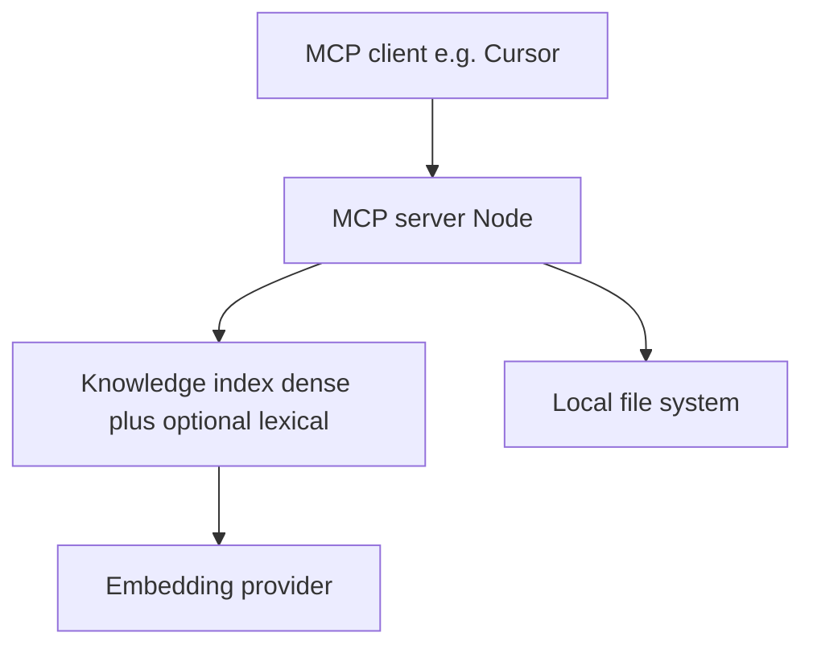
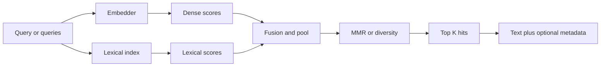

# Solution Architecture

## 1. Overview

* **Change**: enhanced-complex-query-answering
* **Project**: local-doc-ai (MCP knowledge server)
* **Version**: 1.0.0 (increment when implementation ships)
* **Date**: 2026-04-19
* **Status**: Draft

### 1.1 Purpose

This document describes the **solution architecture** for extending the existing local-doc-ai MCP server so it can support **more complicated questions**: hybrid lexical + dense retrieval, optional diversity (MMR / per-document caps), multi-query fusion in one round trip, and optional ranking metadata for the host model. It complements `design.md` (decisions and trade-offs) and `solution-analysis.md` (module-level plan).

### 1.2 Scope

**Included:**

* Retrieval pipeline extensions (lexical index at build time, fusion and diversity at query time).
* MCP tool surface extensions (optional `search_docs` parameters; additional multi-query tool when enabled).
* Configuration for strategy, weights, pool sizes, and verbosity; stderr-safe observability.

**Excluded:**

* Running a chat or answer model inside the MCP (host remains responsible for synthesis).
* Remote knowledge sources (Confluence, S3) beyond what the base product already supports.

### 1.3 Definitions

| Term | Description |
| ---- | ----------- |
| Dense score | Cosine similarity between query embedding and chunk embedding |
| Lexical score | BM25/TF‑IDF (or equivalent) score from a term-based index over chunk text |
| Fusion | Combining dense and lexical scores into one ranking per configured weights |
| MMR | Maximal Marginal Relevance (or similar) to reduce redundant chunks from the same document |

---

## 2. Requirements Mapping

### 2.1 Functional requirements (this change)

| ID | Description | Source |
| ---- | ----------- | ------ |
| FR-CQ-001 | Config selects semantic-only vs hybrid retrieval and related limits | `advanced-retrieval` spec, `document-index-and-retrieval` delta |
| FR-CQ-002 | Index build produces lexical structures when hybrid is enabled | `document-index-and-retrieval` delta |
| FR-CQ-003 | Query path supports fused ranking and optional diversity before final `top_k` | `advanced-retrieval` spec |
| FR-CQ-004 | MCP exposes multi-query retrieval and optional scope filters with safe path rules | `multi-hop-query-support` spec, `mcp-server-and-tools` delta |
| FR-CQ-005 | Optional per-hit metadata (scores, method) when requested | `advanced-retrieval` spec |

### 2.2 Non-functional requirements

| ID | Type | Description |
| ---- | ---- | ----------- |
| NFR-CQ-001 | Compatibility | Default config preserves current semantic-only behavior for existing clients |
| NFR-CQ-002 | Safety | Scope filters reuse existing path resolution rules; no reads outside configured roots |
| NFR-CQ-003 | Stdio safety | Diagnostics continue to use stderr; no routine logs on stdout |

---

## 3. High-Level Architecture

### 3.1 System context (unchanged boundary)

### 3.2 Data flow: complex query (hybrid + optional multi-query)

### 3.3 Components

| Component | Responsibility |
| --------- | -------------- |
| Config loader | New retrieval fields validated with Zod; fail-fast on invalid combinations |
| Corpus / ingestion | Unchanged chunking; passes chunk text into index build for lexical structures when enabled |
| Embedder | Unchanged contract; more calls when multi-query tool runs several embeddings |
| Index / search | `VectorIndex` extended or accompanied by lexical store and fusion/diversity helpers |
| MCP tools | `search_docs` optional args; new multi-query tool; optional JSON/metadata suffix in responses |
| Logging | Info/debug lines on stderr for index build and retrieval mode |

### 3.4 Before → after (this change)

| Area | Before | After |
| ---- | ------ | ----- |
| Retrieval | Single dense embedding + cosine `top_k` | Optional hybrid + fusion; optional larger candidate pool + MMR |
| MCP tools | `search_docs`, `get_document` | Same plus optional advanced args; additional multi-query tool when enabled |
| Config | `retrieval.method: semantic` only | Extended strategy/method and tuning keys (exact names in `solution-analysis.md`) |
| Evidence for hard questions | One shot | Host can request multi-query merge and richer ranking signals |

---

## 4. Detailed Design

### 4.1 Index build

* **Dense**: Existing pipeline (`buildCorpus` → `buildVectorIndex`) remains.
* **Lexical**: When hybrid is enabled, build term statistics / inverted index structures over the same chunk IDs as dense vectors so results stay joinable by `id` or stable `(relativePath, chunkIndex)`.

### 4.2 Query-time ranking

1. Compute dense scores for all chunks or a pruned set (implementation choice documented in analysis).
2. If hybrid: compute lexical scores for the query against the lexical index.
3. Normalize or scale scores per design defaults; fuse with configured weights.
4. Take top `candidate_pool` (config) then apply MMR/diversity; emit final `top_k`.

### 4.3 MCP surface

* **`search_docs`**: Required `query` string preserved; optional fields for metadata and scope (additive).
* **Multi-query tool**: Accepts multiple strings; server merges/dedupes/fuses; respects `top_k` and safety.
* **Response**: Default human-readable lines; optional machine-readable block when requested (format fixed at implementation).

### 4.4 Risks summary

| Risk | Mitigation |
| ---- | ---------- |
| Tuning burden | Sensible defaults matching today’s behavior; document examples |
| Memory / build time for lexical index | Feature-flagged; document footprint |
| Tool sprawl | Prefer clear naming and one primary multi-query tool |

---

## 5. Related documents

| Document | Role |
| -------- | ---- |
| [proposal.md](./proposal.md) | Motivation and capability list |
| [design.md](./design.md) | Key decisions and non-goals |
| [solution-analysis.md](./solution-analysis.md) | Files, symbols, config keys, tests |
| [tasks.md](./tasks.md) | Implementation checklist |
