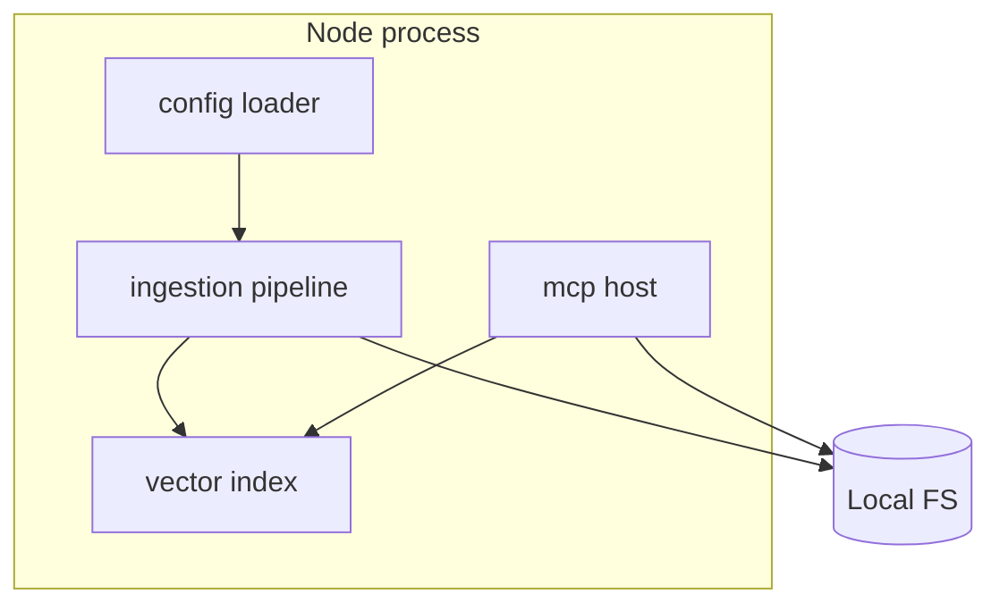
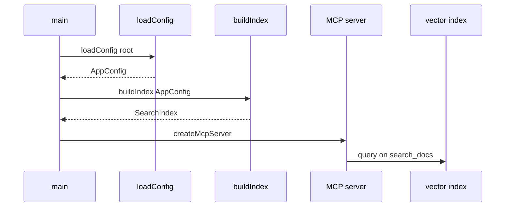

# Solution Analysis

## 1. Overview

* **Project Name**: local-doc-ai
* **Version**: 1.0.0
* **Date**: 2026-04-18
* **Author(s)**: OpenSpec proposal
* **Status**: Draft

### 1.1 Purpose

This document provides implementation-facing detail for the greenfield **local-doc-ai** MCP server: module layout, configuration keys, embedding strategy options, MCP tool behavior, and testing.

### 1.2 Scope

* File-level plan for new `src/` tree and package metadata
* Data shapes for index and tool responses
* Risks, alternatives, and test matrix
* Excludes line-by-line code until `/opsx:apply`

### 1.3 Definitions

| Term | Description |
| ---- | ----------- |
| Root | Project directory containing `openspec/config.yaml` |
| Source | One configured `knowledge_base.sources[]` entry with `type: local_files` |

---

## 2. Functional Analysis

| Component | Function | Description | Dependencies |
| --------- | -------- | ----------- | ------------ |
| Config module | Load YAML | Validates structure against expected keys from `openspec/config.yaml` | `yaml` parser |
| File scanner | Discover files | Enumerates files under each source `path` filtered by `file_types` | `fs`, `path` |
| Extractors | Parse content | `.txt` and `.md` as UTF-8 text; `.pdf` via PDF text extraction | pdf library |
| Chunker | Split text | Fixed `chunk_size` and `chunk_overlap` from `knowledge_base.ingestion` | none |
| Embedder | Vectorize | Produces embeddings for chunks and query strings | provider SDK or local |
| Vector index | Search | Stores vectors and returns top `retrieval.top_k` by similarity | embedder |
| MCP layer | Tools | `McpServer` plus `registerTool` (Zod `inputSchema`) implements `search_docs` and `get_document`; stdio via `StdioServerTransport` | index, scanner, SDK |

---

## 3. Detail Architecture

### 3.1 System Context

### 3.2 Changes Overview

* **Architecture style**: Modular TypeScript packages under `src/` with clear boundaries: `config`, `ingestion`, `search`, `mcp`.
* **Communication**: **Default `StdioServerTransport`** and `await server.connect(transport)` as in the [TypeScript quickstart](https://modelcontextprotocol.io/docs/develop/build-server#typescript). Optional HTTP on `server.port` is out of scope until explicitly implemented.
* **Key decisions**:
  * Single YAML file for operational config; optional `LOCAL_DOC_AI_CONFIG` env override for path.
  * Embedding provider selected via env (for example `EMBEDDING_PROVIDER=openai|local`) with config `models.default` used when calling LLM is added later; v1 search may be embedding-only.
  * Tool registration uses the SDK’s **`server.registerTool(name, { description, inputSchema: { field: z... } }, handler)`** shape; handlers return `{ content: [{ type: "text", text }] }` like the weather example.

### 3.3 Methods and symbols to change

The repository currently has **no `src/` tree**. The following are **planned** files to add.

### `package.json` (new at repo root)

| Symbol | Change |
| ------ | ------ |
| `type` | **Add** — `"module"` if using ESM imports like `@modelcontextprotocol/sdk/server/mcp.js` (per official TypeScript tab). |
| `scripts.build` | **Add** — `tsc` (or project build) emitting to `./build` per tutorial `tsconfig` `outDir`. |
| `scripts.start` | **Add** — run compiled entry (for example `node build/index.js` after build). |
| `dependencies` | **Add** — `@modelcontextprotocol/sdk`, **`zod@3`**, YAML parser, PDF text dependency, embedding client as chosen. |

### `src/config/loadConfig.ts`

| Symbol | Change |
| ------ | ------ |
| `loadConfig(rootDir: string)` | **Add** — Read `openspec/config.yaml`, resolve relative paths from root, apply defaults for missing optional keys if any. |
| `AppConfig` (type) | **Add** — Mirrors sections `server`, `knowledge_base`, `retrieval`, `tools`, `models`, `logging`. |

### `src/ingestion/chunk.ts`

| Symbol | Change |
| ------ | ------ |
| `chunkText(text: string, chunkSize: number, overlap: number)` | **Add** — Returns array of `{ text, start, end }` per config. |

### `src/ingestion/extract.ts`

| Symbol | Change |
| ------ | ------ |
| `extractText(filePath: string, ext: string)` | **Add** — Dispatch to markdown or PDF extractor; throws on unsupported type. |

### `src/ingestion/buildIndex.ts`

| Symbol | Change |
| ------ | ------ |
| `buildIndex(config: AppConfig, embedder: Embedder)` | **Add** — Scan sources, chunk, embed, return in-memory index object. |

### `src/search/semanticSearch.ts`

| Symbol | Change |
| ------ | ------ |
| `search(query: string, k: number)` | **Add** — Embed query, cosine similarity over chunk vectors, return ranked list with `filename`, `snippet`, `score`. |

### `src/mcp/registerTools.ts`

| Symbol | Change |
| ------ | ------ |
| `registerLocalDocTools(server: McpServer, deps)` | **Add** — Calls **`server.registerTool`** twice: `search_docs` and `get_document`, each with `description` and **`inputSchema`** using **Zod** fields (`query: z.string()...`, `filename: z.string()...`) matching `openspec/config.yaml`. Handlers return SDK-style **`{ content: [{ type: "text", text }] }`** payloads. |

### `src/mcp/server.ts`

| Symbol | Change |
| ------ | ------ |
| `createServer(config: AppConfig)` | **Add** — **`new McpServer({ name: config.project.name, version: "1.0.0" })`** (or version from package), then register tools. |
| `runStdioServer(server: McpServer)` | **Add** — `const transport = new StdioServerTransport(); await server.connect(transport);` plus stderr-only startup log per tutorial. |

### `src/index.ts`

| Symbol | Change |
| ------ | ------ |
| `main()` | **Add** — Async entry: `loadConfig`, `buildIndex`, `createServer`, `registerLocalDocTools`, `runStdioServer`; **`main().catch`** logs to **stderr** and `process.exit(1)` on fatal error (pattern from TypeScript tab). |

---

## 4. Design Alternatives

| Component | Option | Pros | Cons | Recommendation |
| --------- | ------ | ---- | ---- | -------------- |
| Embeddings | Remote API | High quality, fast to ship | Data leaves machine if used | Start with opt-in env + clear logging |
| Embeddings | Local model | Strong privacy | Heavier deps, slower | Phase 2 if required |
| Index store | In-memory | Simple | Rebuild on restart | Accept for v1 local dev |
| Index store | SQLite + vectors | Persistent | More code | Future enhancement |
| MCP transport | stdio | Matches [official TypeScript guide](https://modelcontextprotocol.io/docs/develop/build-server#typescript); works with Cursor and Claude Desktop patterns | `server.port` unused | **Default for v1** |
| MCP transport | HTTP on port 3000 | Matches `server.port` in YAML | Extra setup | Optional later if a streamable HTTP transport is added |

---

## 5. Detailed Component Analysis

### Component: Config loader

* **Responsibilities**: Load YAML; ensure `knowledge_base.sources` non-empty; normalize paths; validate `retrieval.method` includes `semantic` for this implementation scope.
* **Interfaces**: Exported types for downstream modules.
* **Dependencies**: `fs`, YAML parser.
* **Performance**: One-time load at startup unless watch mode is added later.
* **Security**: No execution of paths as code; treat paths as data.

### Component: MCP tool handlers

* **Responsibilities**: Register tools with **`registerTool`** and **Zod** `inputSchema` fields so inputs match `search_docs` (`query` required) and `get_document` (`filename` required) per `openspec/config.yaml`.
* **Security**: Reject `filename` values containing `..` or absolute paths outside roots after `path.resolve` and `root` checks.

---

## 6. Data Flow Analysis

---

## 7. Risk & Impact Analysis

| Risk | Probability | Impact | Mitigation |
| ---- | ----------- | ------ | ---------- |
| Misconfigured path reads entire disk | Low | High | Restrict to declared roots; log scanned roots at info level |
| PDF extraction failure | Medium | Medium | Return clear error in tool result; skip file with warning in logs |
| Embedding API quota | Medium | Medium | Retry with backoff; surface error text to client |

---

## 8. Testing Strategy

| Test Case ID | Component | Type | Input | Expected Output | Description |
| ------------ | --------- | ---- | ----- | --------------- | ----------- |
| TC-001 | chunkText | Unit | Synthetic long string | Chunks respect size and overlap | Chunk boundaries match config math |
| TC-002 | loadConfig | Unit | Minimal valid YAML fixture | Typed object with expected numbers | Parsing matches `openspec/config.yaml` shape |
| TC-003 | get_document | Integration | Filename inside docs fixture | Full text returned | Path sandbox works |
| TC-004 | get_document | Integration | Path with parent segments | Error, no file read | Blocks traversal |
| TC-005 | search_docs | Integration | Query related to fixture doc | Top result includes doc identifier | Semantic path smoke test |
| TC-006 | MCP server | Manual | Cursor lists tools | `search_docs` and `get_document` visible | End-to-end wiring |

---

## 9. Open Questions

* Confirm whether HTTP listener on `server.port` is mandatory for v1 or stdio suffices.
* Pick default embedding provider for developer onboarding (document env vars in README during apply).

---

## 10. Appendix

### 10.1 References

* `openspec/config.yaml`
* `solution-architecture.md` in this change folder

### 10.2 Change Log

| Version | Date | Changes |
| ------- | ---- | ------- |
| 1.0.0 | 2026-04-18 | Initial version |
