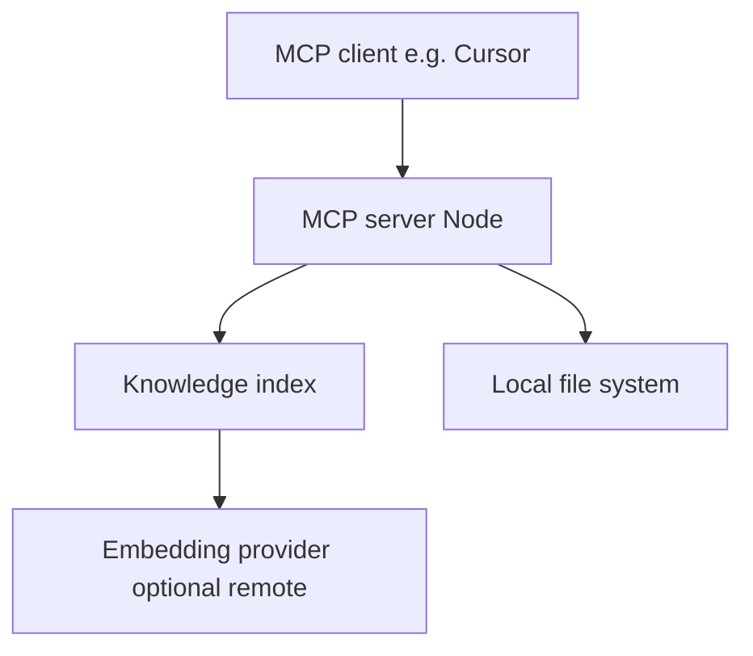
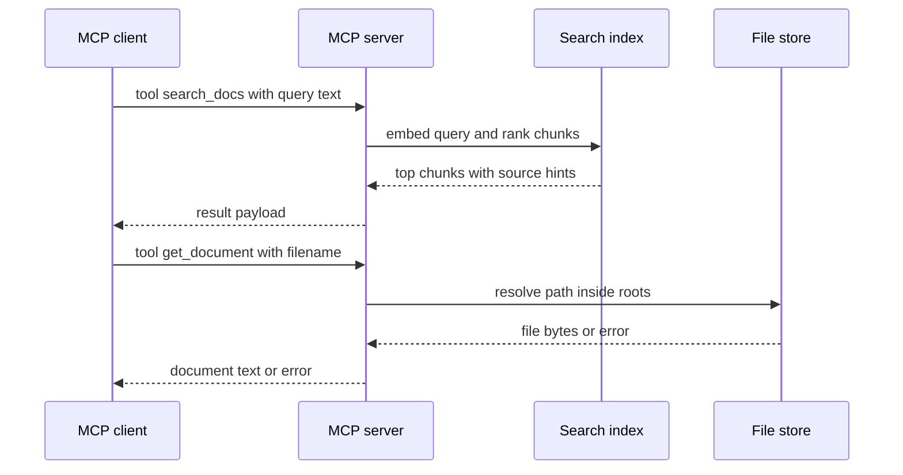

# Solution Architecture

## 1. Overview

* **Project Name**: local-doc-ai
* **Version**: 1.0.0
* **Date**: 2026-04-18
* **Author(s)**: OpenSpec proposal
* **Status**: Draft

### 1.1 Purpose

This document describes the solution architecture for implementing the **local-doc-ai** MCP knowledge server defined in `openspec/config.yaml`: local-only document ingestion, semantic retrieval, and MCP tools `search_docs` and `get_document`.

### 1.2 Scope

**Included:**

* Node.js MCP server process, config loading, ingestion and chunking, embedding-backed search, MCP tool surface, logging.

**Excluded:**

* Hosted multi-tenant deployment, web UI, non-local knowledge sources (Confluence, S3), and automatic sync of external repos beyond configured local paths.

### 1.3 Definitions

| Term | Description |
| ---- | ----------- |
| MCP | Model Context Protocol; JSON-RPC tool surface for AI clients |
| KB | Knowledge base: indexed chunks and metadata derived from local files |
| Embedding | Vector representation of text used for semantic similarity |

---

## 2. Requirements Mapping

### 2.1 Functional Requirements

| ID | Description | Source |
| ---- | ----------- | ------ |
| FR-001 | System loads configuration from project YAML | `openspec/config.yaml` |
| FR-002 | System indexes allowed file types under configured paths | Proposal |
| FR-003 | System exposes `search_docs` and `get_document` via MCP | `openspec/config.yaml` tools |
| FR-004 | Semantic search returns top `k` chunks | `retrieval.top_k` |

### 2.2 Non-Functional Requirements

| ID | Type | Description |
| ---- | ---- | ----------- |
| NFR-001 | Privacy | Default design keeps documents local; remote APIs optional for embeddings only |
| NFR-002 | Observability | Log level from `logging.level` |
| NFR-003 | Safety | Path resolution constrained to configured roots |

---

## 3. High-Level Architecture

### 3.1 System Context

### 3.2 Architecture Overview

* **Architecture style**: Single-process MCP server with in-process index (phase 1) or pluggable store (phase 2 if needed).
* **Communication**: **Primary path: MCP over stdio** using `StdioServerTransport`, matching the [official TypeScript tutorial](https://modelcontextprotocol.io/docs/develop/build-server#typescript). Streamable HTTP or SSE may be added later; `server.port` in YAML applies only when such a transport is implemented.
* **Key decisions**:
  * YAML config is the single source of truth for sources, chunking, retrieval, tools, and logging.
  * Tool contracts match `tools` in config to avoid drift between docs and runtime.
  * Tools are registered with **`McpServer.registerTool`** and **Zod**-described `inputSchema` fields, as in the TypeScript quickstart (not raw JSON Schema objects in application code unless the SDK requires it).
  * **Stdio safety**: never log to stdout (avoids corrupting JSON-RPC); use stderr or a logging library that writes to stderr or files.

### 3.3 Components

| Component | Responsibility |
| --------- | -------------- |
| Config loader | Parse and validate `openspec/config.yaml`, resolve paths relative to project root |
| Ingestion | Walk sources, extract text, chunk with overlap, assign stable chunk IDs |
| Embeddings | Produce vectors for chunks; abstracted for local vs API backends |
| Index store | Map embeddings to chunk text and source file metadata |
| MCP host | `McpServer` instance: `registerTool` handlers, dispatch `search_docs` and `get_document`, return `{ content: [{ type: "text", text }] }` shaped results per SDK patterns |
| Logging | Level-based logging from config |

### 3.4 High-level changes (before → after)

| Area | Today (before) | After this change |
| ---- | -------------- | ----------------- |
| Runnable server | Config and intent only; no `src/` or package | Node package runs MCP server and serves tools |
| Document access | N/A | Reads `.txt`, `.md`, `.pdf` under configured roots only |
| Search | N/A | Semantic search over chunks with `top_k` from config |
| MCP tools | N/A | `search_docs` and `get_document` implemented per YAML schemas |

**Unchanged boundary:** Repository remains a **local-first** project; no requirement to add cloud document backends in this change.

---

## 4. Detailed Design

### 4.1 Component Breakdown

#### Component: Config loader

* **Description**: Loads and validates YAML; exposes typed config to other modules.
* **Responsibilities**: Path resolution, defaults, fail-fast on invalid structure.
* **Dependencies**: File system.
* **Interfaces**: Exported `loadConfig(rootPath)` returning typed config object.

#### Component: Ingestion and index

* **Description**: Builds searchable chunks from local files.
* **Responsibilities**: Filter by extension, decode UTF-8, PDF text extraction, chunking with overlap.
* **Dependencies**: Config loader, file system, PDF library.
* **Interfaces**: `buildIndex(config)` or incremental `syncIndex` (exact API in solution-analysis).

#### Component: MCP server

* **Description**: Hosts MCP protocol and tool handlers.
* **Responsibilities**: Register tools from config names and schemas; validate inputs; safe filename resolution for `get_document`.
* **Dependencies**: Index, config.
* **Interfaces**: MCP SDK server setup; tool callbacks.

---

### 4.2 Data Flow

---

### 4.3 Data Model

| Entity | Fields |
| ------ | ------ |
| Document | `sourceId`, `relativePath`, `bytesHash`, `mimeHint` |
| Chunk | `chunkId`, `documentId`, `text`, `startOffset`, `endOffset` |
| Embedding record | `chunkId`, `vector`, `modelId` |

---

## 5. Technology Stack

| Layer | Technology | Justification |
| ----- | ---------- | ------------- |
| Runtime | Node.js LTS (per doc: Node 16+; prefer current LTS) | Matches `server.runtime: node` in config |
| Language | TypeScript | Matches official tutorial (`module` / `moduleResolution` Node16-style as in guide) |
| MCP | `@modelcontextprotocol/sdk` | `McpServer`, `StdioServerTransport` per [TypeScript tab](https://modelcontextprotocol.io/docs/develop/build-server#typescript) |
| Schemas | `zod@3` | Tool `inputSchema` objects in `registerTool` use Zod fields as in the tutorial |
| PDF | Common Node PDF text library (TBD in implementation) | Extract text for `.pdf` sources |
| Embeddings | Pluggable provider | Allows local models or API per environment |

---

## 6. Observability

### 6.1 Logging

Structured or leveled logs per `logging.level` in config (for example `info` default).

### 6.2 Monitoring

Not applicable for this change — single local process without metrics pipeline.

### 6.3 Alerting

Not applicable for this change.

---

## 7. Risks & Trade-offs

| Risk | Impact | Mitigation |
| ---- | ------ | ---------- |
| Remote embedding API sends text off-device | Privacy | Document opt-in; support local embeddings when feasible |
| Large PDFs or folders slow startup | Latency | Lazy indexing or background sync in later iteration |
| Path traversal via `filename` | Security | Canonicalize paths and enforce roots |

---

## 8. Open Questions

* Whether stdio-only vs HTTP transport is required for the target MCP clients first.
* Preferred embedding backend for v1 (local `transformers` vs OpenAI-compatible API).

---

## 9. Appendix

### 9.1 References

* `openspec/config.yaml`
* Proposal: `openspec/changes/implement-local-doc-ai-mcp/proposal.md`

### 9.2 Change Log

| Version | Date | Changes |
| ------- | ---- | ------- |
| 1.0.0 | 2026-04-18 | Initial version |
