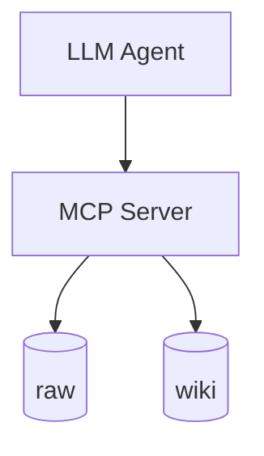
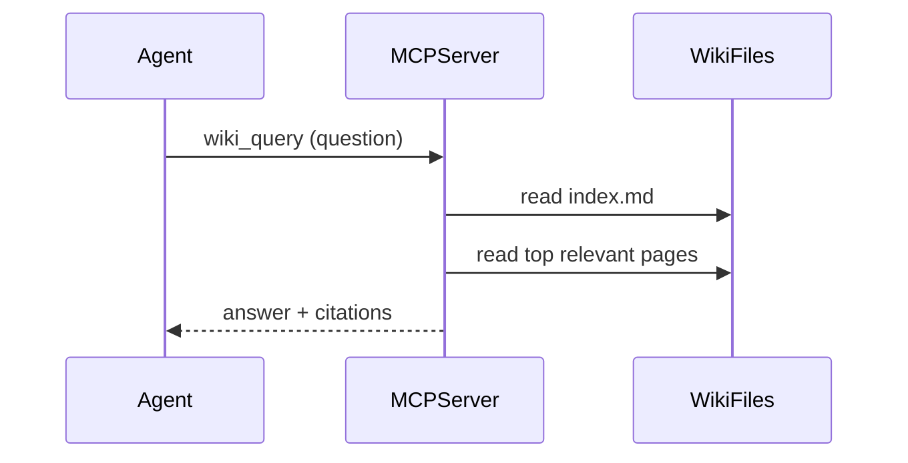

# Solution Analysis

## 1. Overview

* **Project Name**: local-doc-ai-mcp
* **Version**: 1.0 (change proposal)
* **Date**: 2026-04-20
* **Author(s)**: Cursor Agent
* **Status**: Draft

### 1.1 Purpose

Provide implementation-facing details for adding an LLM-maintained wiki layer and associated MCP workflows, including concrete files/symbols to change, data shapes, and a testing strategy.

### 1.2 Scope

* MCP tool additions for wiki operations
* Retrieval/config changes to support wiki-first behavior
* Filesystem layout conventions and required wiki pages

### 1.3 Definitions

| Term | Description |
| ---- | ----------- |
| KB | Combined `raw/` + `wiki/` roots |
| Wiki-first | Prefer wiki pages for Q&A before falling back to raw sources |

---

## 2. Functional Analysis

| Component | Function | Description | Dependencies |
| --------- | -------- | ----------- | ------------ |
| MCP tools | Wiki ingest | Read raw source, update wiki pages + index/log | `src/mcp/registerTools.ts`, ingestion/extraction |
| MCP tools | Wiki query | Route via `wiki/index.md`, read pages, produce citations | retrieval/search utilities |
| MCP tools | Wiki lint | Detect structural issues (orphans, missing index entries) | filesystem + simple parsing |
| Retrieval | Search both layers | Optionally prefer wiki results | `src/search/*`, `src/config/loadConfig.ts` |

---

## 3. Detail Architecture

### 3.1 System Context

### 3.2 Changes Overview

* Add wiki operations as first-class MCP tools.
* Add config to define/recognize the wiki root and enable wiki-first behavior.
* Extend path scoping so callers can target `wiki/` explicitly (and safely).

### 3.3 Methods and symbols to change

### `src/mcp/registerTools.ts`

| Symbol | Change |
| ------ | ------ |
| `registerLocalDocTools` | **Change** — register new wiki tools alongside `search_docs` and `get_document` |
| `searchDocsInputSchema` | **Change** — allow targeting wiki vs raw (via path prefixes and/or an explicit scope) |

### `src/config/loadConfig.ts`

| Symbol | Change |
| ------ | ------ |
| `loadConfig` (and config schema types) | **Change** — add config keys for wiki root and wiki-first query preference |

### `src/paths/pathPrefix.ts`

| Symbol | Change |
| ------ | ------ |
| `normalizePathPrefix` | **Change** — ensure prefixes can safely reference `wiki/` and `raw/` while staying under configured roots |

### `src/paths/resolveDocument.ts`

| Symbol | Change |
| ------ | ------ |
| `resolveDocumentPath` | **Change** — resolve documents across multiple configured roots (raw + wiki) and return relative paths consistently |

### `src/ingestion/discover.ts`

| Symbol | Change |
| ------ | ------ |
| discovery logic | **Change** — treat raw/wiki as separate sources; optionally apply different file-type allowlists |

### `src/search/hybridRetriever.ts`

| Symbol | Change |
| ------ | ------ |
| `retrieveRankedWithOptions` | **Change** — optionally boost or filter wiki results when wiki-first is enabled |

---

## 4. Design Alternatives

| Component | Option | Pros | Cons | Recommendation |
| --------- | ------ | ---- | ---- | -------------- |
| Wiki updates | Agent writes files directly | Simple | Hard to standardize; harder to lint | Prefer server-level tools for structured ops |
| Query routing | Embed everything | Powerful | Added infra/complexity | Keep index-driven routing; optional later |
| Multi-file edits | Direct write | Fast | Partial-failure risk | Start direct with clear “changed files”; consider plan/apply later |

---

## 5. Detailed Component Analysis

### Component: Wiki filesystem conventions

* **Responsibilities**:
  * Ensure the wiki has stable “entry points” (`index.md`, `log.md`)
  * Define namespaces for pages (sources, entities, concepts, analyses)
* **Interfaces**:
  * MCP tools should create missing `index.md`/`log.md` as needed
* **Performance Considerations**:
  * Index-driven routing keeps reads bounded (few pages per query)
* **Security Analysis**:
  * Enforce path traversal protections and root confinement

### Component: Wiki ingest tool

* **Responsibilities**:
  * Create/update a per-source summary page under `wiki/sources/`
  * Update `wiki/index.md` and append `wiki/log.md`
  * Return structured list of touched files
* **Interfaces**:
  * Input includes `source_path` (relative to raw roots) and optional `title/tags`

### Component: Wiki lint tool

* **Responsibilities**:
  * Identify orphan pages (no inbound links or missing index entry)
  * Identify missing required pages (`index.md`, `log.md`)
  * Detect duplicate page titles / near duplicates (lightweight heuristics)

---

## 6. Data Flow Analysis

---

## 7. Risk & Impact Analysis

| Risk | Probability | Impact | Mitigation |
| ---- | ----------- | ------ | ---------- |
| Wiki contains incorrect synthesis | Medium | High | citations, lint passes, keep raw immutable |
| Regression in existing retrieval | Medium | Medium | keep existing tools working; default behaviors preserved |
| Path traversal / unsafe writes | Low | High | strict normalization + root allowlist checks |

---

## 8. Testing Strategy

| Test Case ID | Component | Type | Input | Expected Output | Description |
| ------------ | --------- | ---- | ----- | --------------- | ----------- |
| TC-001 | Path scoping | Unit | `path_prefix="wiki/.."` | error | Reject traversal attempts |
| TC-002 | Multi-root resolve | Unit | wiki file path | resolved absolute path under wiki root | Resolve wiki documents correctly |
| TC-003 | Wiki ingest | Integration | small raw markdown file | summary created, index/log updated | End-to-end ingest touches expected files |
| TC-004 | Wiki query routing | Integration | question about a known wiki page | wiki pages read and cited | Query prefers wiki over raw |
| TC-005 | Wiki lint | Unit/Integration | wiki with missing index entry | issue reported | Lint surfaces structural issues |

---

## 9. Open Questions

* What is the initial minimal set of wiki page namespaces to enforce (`sources/`, `entities/`, `concepts/`, `analyses/`)?
* Should `wiki_query` itself write answers back, or only via an explicit `wiki_file_answer` tool?

---

## 10. Appendix

### 10.1 References

* `openspec/changes/llm-wiki/solution-architecture.md`
* `openspec/changes/archive/2026-04-19-implement-local-doc-ai-mcp/` (example of archived completed change structure)

### 10.2 Change Log

| Version | Date | Changes |
| ------- | ---- | ------- |
| 1.0 | 2026-04-20 | Initial draft |

