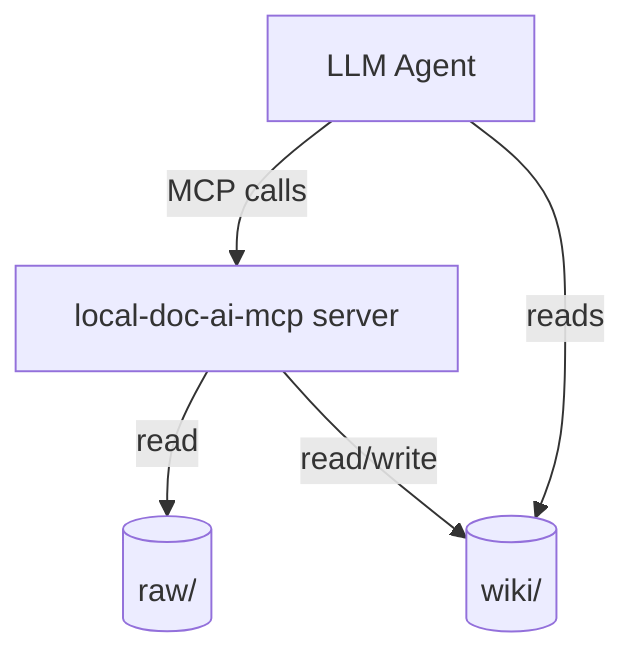
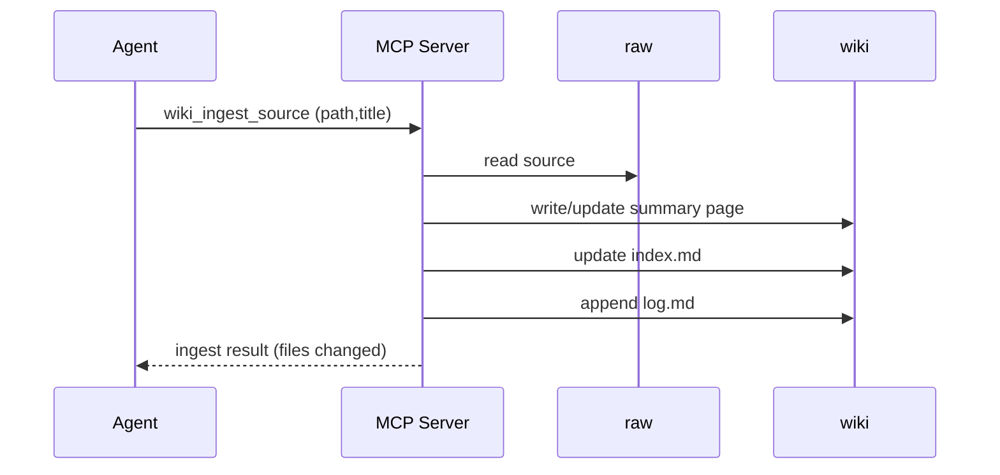

# Solution Architecture

## 1. Overview

* **Project Name**: local-doc-ai-mcp
* **Version**: 1.0 (change proposal)
* **Date**: 2026-04-20
* **Author(s)**: Cursor Agent
* **Status**: Draft

### 1.1 Purpose

Define the high-level architecture and operating model for an **LLM-maintained wiki** that compiles knowledge from immutable raw sources into a persistent, interlinked markdown wiki, operated via MCP tools.

### 1.2 Scope

**Included:**

* Directory layout conventions for `raw/` and `wiki/`
* Main workflows (ingest, query, file answers, lint)
* How these workflows map onto MCP tool boundaries
* High-level changes to retrieval to prefer wiki

**Excluded:**

* UI/Obsidian plugin implementation
* Exact prompts/policies for the LLM (kept flexible)
* Optional external search engines (can be integrated later)

### 1.3 Definitions

| Term | Description |
| ---- | ----------- |
| Raw sources | Immutable input documents under `raw/` |
| Wiki | LLM-owned markdown pages under `wiki/` |
| Index | `wiki/index.md`, content-oriented catalog for navigation |
| Log | `wiki/log.md`, append-only operations history |
| KB | Knowledge base (raw + wiki) |

---

## 2. Requirements Mapping

### 2.1 Functional Requirements

| ID | Description | Source |
| -- | ----------- | ------ |
| FR-001 | Define a standard `raw/` + `wiki/` layout and conventions | Proposal |
| FR-002 | Ingest a raw source and update multiple wiki pages | Proposal |
| FR-003 | Query wiki-first with citations and optional raw fallback | Proposal |
| FR-004 | Lint wiki health (orphans/contradictions/staleness) | Proposal |

### 2.2 Non-Functional Requirements

| ID | Type | Description |
| -- | ---- | ----------- |
| NFR-001 | Safety | Raw sources SHALL remain immutable |
| NFR-002 | Determinism | Wiki maintenance operations should be idempotent where feasible |
| NFR-003 | Usability | A small/medium wiki must work without embedding infrastructure by relying on `wiki/index.md` navigation |

---

## 3. High-Level Architecture

### 3.1 System Context

### 3.2 Architecture Overview

* Architecture Style: single Node.js MCP server with file-based knowledge base
* Communication: MCP tools (JSON input/output)
* Key Ideas:
  * **Two layers**: immutable raw vs synthesized wiki
  * **Wiki-first** query path: use `wiki/index.md` to route to relevant pages
  * **Operations are first-class**: ingest, query, lint become explicit tools/workflows

### 3.3 Components

| Component | Responsibility |
| --------- | -------------- |
| MCP server | Expose tools for retrieval and wiki operations |
| `raw/` | Immutable source-of-truth documents |
| `wiki/` | Persistent, compounding markdown knowledge base |
| Agent | Orchestrates ingest/query/lint and decides what to file |

### 3.4 High-level changes (before → after)

| Area | Today (before) | After this change |
| ---- | -------------- | ----------------- |
| Knowledge model | Retrieval over configured folders, mostly raw docs | Two-layer KB: `raw/` + LLM-owned `wiki/` |
| Query routing | Search raw documents for chunks | Prefer wiki pages via `wiki/index.md`, with optional raw fallback |
| Maintenance | No durable synthesis layer | Ingest updates wiki pages + index/log; lint checks wiki health |
| Tooling surface | `search_docs`, `get_document` | Add wiki-specific tools (ingest/query/file/lint) while keeping existing tools |

**Unchanged boundary (optional):**
* Raw files remain readable via existing tools (and stay immutable).

---

## 4. Detailed Design

### 4.1 Component Breakdown

#### Component: Wiki layout (`wiki/`)

* **Responsibilities**:
  * Provide durable, navigable markdown pages that summarize/synthesize raw sources
  * Maintain `wiki/index.md` (catalog) and `wiki/log.md` (timeline)
* **Interfaces**:
  * MCP tools for reading/writing wiki pages (directly or through higher-level operations)

#### Component: Ingest workflow

* **Responsibilities**:
  * Create/update a wiki summary page for the new source
  * Update related concept/entity pages
  * Update `wiki/index.md` and append to `wiki/log.md`
* **Interfaces**:
  * A single high-level MCP tool that applies the workflow, plus smaller primitives as needed

#### Component: Query workflow

* **Responsibilities**:
  * Route via `wiki/index.md`
  * Read a bounded set of wiki pages
  * Produce a cited answer; optionally file it as a wiki page
* **Interfaces**:
  * A wiki query tool that returns answer + citations + suggested pages to update

---

### 4.2 Data Flow

---

### 4.3 Data Model

| Entity | Fields |
| ------ | ------ |
| WikiCitation | `path`, `anchor` (heading or line range), `kind` (wiki/raw) |
| WikiUpdate | `path`, `action` (create/update), `reason` |
| IngestResult | `source`, `updates[]`, `created[]`, `updated[]` |

---

## 5. Technology Stack

| Layer | Technology | Justification |
| ----- | ---------- | ------------- |
| MCP server | Node.js + `@modelcontextprotocol/sdk` | Existing repo architecture |
| Parsing | Markdown-as-text (plus optional light parsing later) | Keep simple; avoid heavy deps |
| Storage | Local filesystem | Matches “wiki is a git repo of markdown files” |

---

## 6. Observability

### 6.1 Logging

* Append to `wiki/log.md` for user-facing traceability.

### 6.2 Monitoring

Not applicable for this change.

### 6.3 Alerting

Not applicable for this change.

---

## 7. Risks & Trade-offs

| Risk | Impact | Mitigation |
| ---- | ------ | ---------- |
| Wiki drift (unsupported claims) | Incorrect knowledge accumulates | Prefer citations, lint to flag contradictions/staleness |
| Too many pages | Navigation degrades | Index conventions + lint for orphans/duplicates |
| Multi-file edit brittleness | Partial updates | Idempotent operations; return changed-file list; consider dry-run mode later |

---

## 8. Open Questions

* Should wiki operations expose a dry-run “plan” mode from day one, or follow-up?
* How strict should wiki conventions be (required frontmatter vs optional)?

---

## 9. Appendix

### 9.1 References

* `openspec/llm.md`
* Archived work patterns under `openspec/changes/archive/` (e.g. `openspec/changes/archive/2026-04-19-implement-local-doc-ai-mcp/`)

### 9.2 Change Log

| Version | Date | Changes |
| ------- | ---- | ------- |
| 1.0 | 2026-04-20 | Initial draft |

